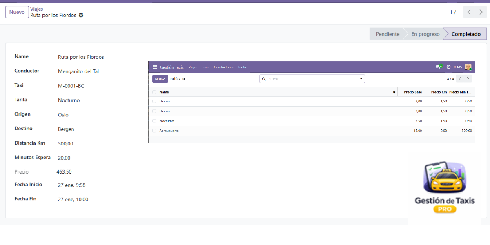
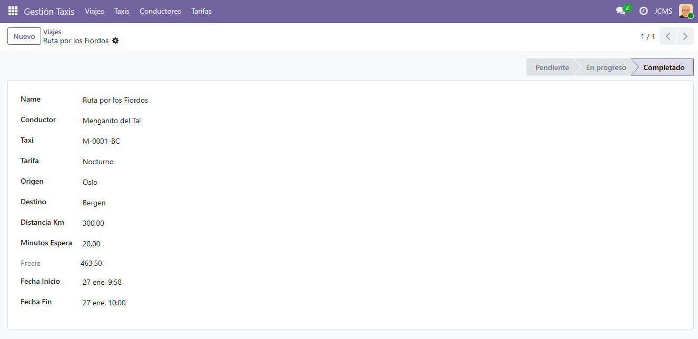
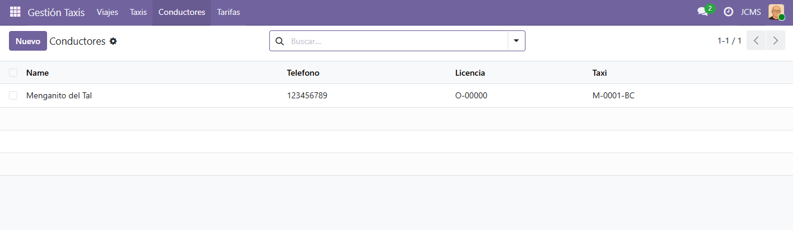
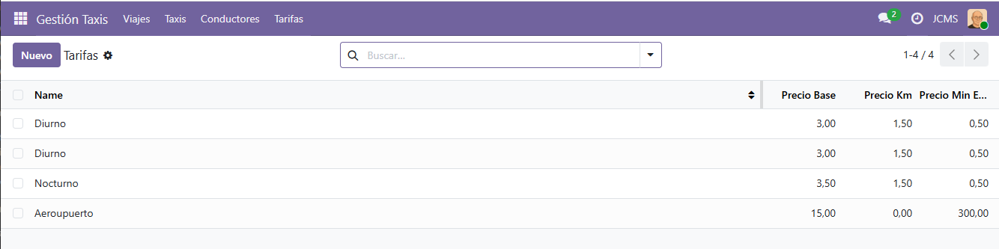
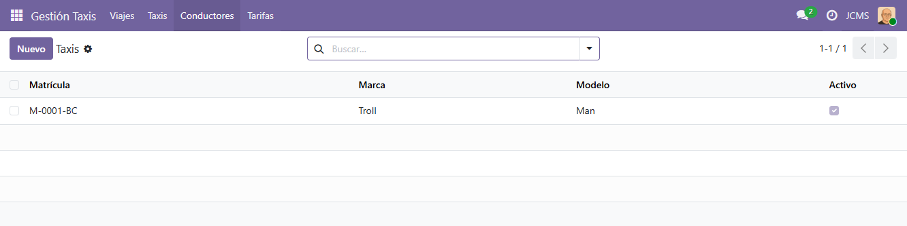
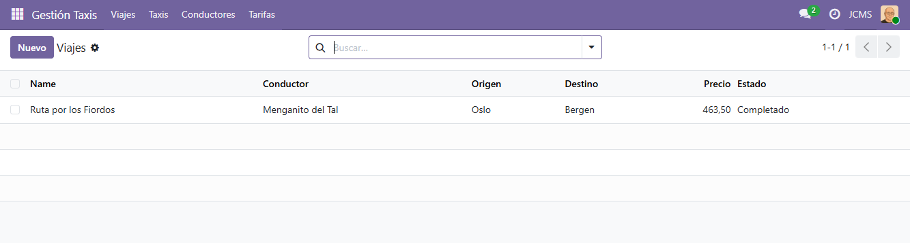

# 🚕 Gestión de Taxis PRO


Módulo completo para la gestión de flotas de taxis, conductores, tarifas y viajes en Odoo 19.



## 📋 Tabla de Contenidos

- [Características](#-características)
- [Capturas de Pantalla](#-capturas-de-pantalla)
- [Instalación](#-instalación)
- [Configuración](#-configuración)
- [Uso](#-uso)
- [Cálculo de Precios](#-cálculo-de-precios)
- [Requisitos](#-requisitos)
- [Soporte](#-soporte)
- [Licencia](#-licencia)

## ✨ Características

### 🚕 Gestión de Taxis
- ✅ Registro completo de vehículos
- ✅ Control de matrícula, marca y modelo
- ✅ Estado activo/inactivo de cada taxi
- ✅ Seguimiento de la flota completa

### 👨‍✈️ Gestión de Conductores
- ✅ Base de datos de conductores
- ✅ Información de contacto (teléfono)
- ✅ Número de licencia
- ✅ Asignación de taxi a conductor
- ✅ Estado activo/inactivo

### 💰 Gestión de Tarifas
- ✅ Tarifas personalizables
- ✅ Precio base del servicio
- ✅ Precio por kilómetro
- ✅ Precio por minuto de espera
- ✅ Múltiples tarifas (diurna, nocturna, festiva, etc.)

### 🚖 Gestión de Viajes
- ✅ Registro detallado de cada viaje
- ✅ Selección de conductor y taxi
- ✅ Puntos de origen y destino
- ✅ Cálculo automático de precio
- ✅ Control de estados del viaje:
  - **Pendiente**: Viaje programado
  - **En progreso**: Viaje en curso
  - **Completado**: Viaje finalizado
  - **Cancelado**: Viaje cancelado
- ✅ Registro automático de fechas de inicio y fin

## 📸 Capturas de Pantalla

### Vista de Taxis


### Vista de Conductores


### Vista de Tarifas


### Vista de Taxis


### Vista de Viajes


## 📦 Instalación

1. Clonar o descargar el módulo en la carpeta `addons` de Odoo:
```bash
cd /path/to/odoo/addons
git clone <tu-repositorio>/gestion_taxis_pro.git
```

2. Reiniciar el servidor Odoo:
```bash
./odoo-bin -u gestion_taxis_pro -d tu_base_de_datos
```

3. Actualizar la lista de aplicaciones en Odoo:
   - Ir a **Aplicaciones**
   - Hacer clic en **Actualizar lista de aplicaciones**

4. Buscar "Gestión de Taxis PRO" e instalar

## ⚙️ Configuración

Después de instalar el módulo:

1. **Registrar Taxis**
   - Ir a **Gestión Taxis → Taxis**
   - Hacer clic en **Nuevo**
   - Ingresar matrícula, marca, modelo

2. **Dar de alta Conductores**
   - Ir a **Gestión Taxis → Conductores**
   - Hacer clic en **Nuevo**
   - Ingresar nombre, teléfono, licencia
   - Asignar taxi

3. **Configurar Tarifas**
   - Ir a **Gestión Taxis → Tarifas**
   - Hacer clic en **Nuevo**
   - Definir precio base, precio/km, precio/min

## 🚀 Uso

### Crear un Viaje

1. Ir a **Gestión Taxis → Viajes**
2. Hacer clic en **Nuevo**
3. Completar los datos:
   - Conductor
   - Taxi
   - Tarifa
   - Origen y destino
   - Distancia (km)
   - Minutos de espera
4. El precio se calculará automáticamente
5. Hacer clic en **Iniciar** para comenzar el viaje
6. Hacer clic en **Completar** cuando finalice

## 💵 Cálculo de Precios

El precio de cada viaje se calcula automáticamente con la fórmula:

```
Precio Total = Precio Base + (Distancia × Precio/km) + (Minutos Espera × Precio/min)
```

### Ejemplo:

| Concepto | Valor |
|----------|-------|
| Precio Base | €3.00 |
| Distancia | 10 km × €1.50/km = €15.00 |
| Tiempo de Espera | 5 min × €0.50/min = €2.50 |
| **Total** | **€20.50** |

## 📋 Requisitos

- **Odoo**: 19.0
- **Módulos dependientes**: 
  - `base`
  - `account`
- **Python**: 3.10+
- **Base de datos**: PostgreSQL 12+

## 📁 Estructura del Módulo

```
gestion_taxis_pro/
├── __init__.py
├── __manifest__.py
├── README.rst
├── README.md
├── models/
│   ├── __init__.py
│   ├── taxi.py
│   ├── conductor.py
│   ├── tarifa.py
│   └── viaje.py
├── security/
│   └── ir.model.access.csv
├── views/
│   ├── viaje_views.xml
│   ├── taxi_views.xml
│   ├── conductor_views.xml
│   └── tarifa_views.xml
└── static/
    └── description/
        ├── icon.png
        ├── banner.png
        ├── screenshot_taxis.png
        ├── screenshot_conductores.png
        ├── screenshot_tarifas.png
        ├── screenshot_viajes.png
        └── index.html
```

## 🆘 Soporte

Para soporte técnico o consultas:

- **Empresa**: JCMS
- **Website**: [https://www.juancarlosmacias.es](https://www.juancarlosmacias.es)
- **Email**: juancarlosmaciassalvador@gmail.com
- **Documentación**: Incluida en el módulo
- **Artículo del módulo**: [Ver guía completa](https://juancarlosmacias.es/article/modulo-de-gestion-de-flotas-de-taxis-con-odoo)

## 📝 Changelog

### v1.1 (Actual)
- ✅ Gestión básica de taxis, conductores, tarifas y viajes
- ✅ Cálculo automático de precios
- ✅ Control de estados de viajes
- ✅ Interfaz intuitiva compatible con Odoo 19
- ✅ Uso de vistas `list` en lugar de `tree`
- ✅ Atributo `invisible` en lugar de `states`

## 👥 Créditos

- **Autor**:JCMS
- **Mantenedor**: juancarlosmacias
- **Contribuidores**: [Lista de contribuidores]

## 📄 Licencia

Este módulo está licenciado bajo [LGPL-3](LICENSE).

---

**Desarrollado con ❤️ para la comunidad Odoo**
