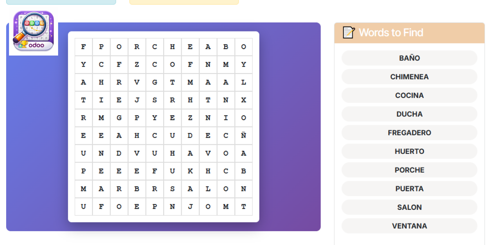
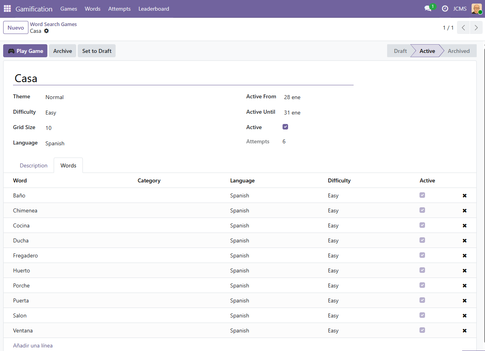
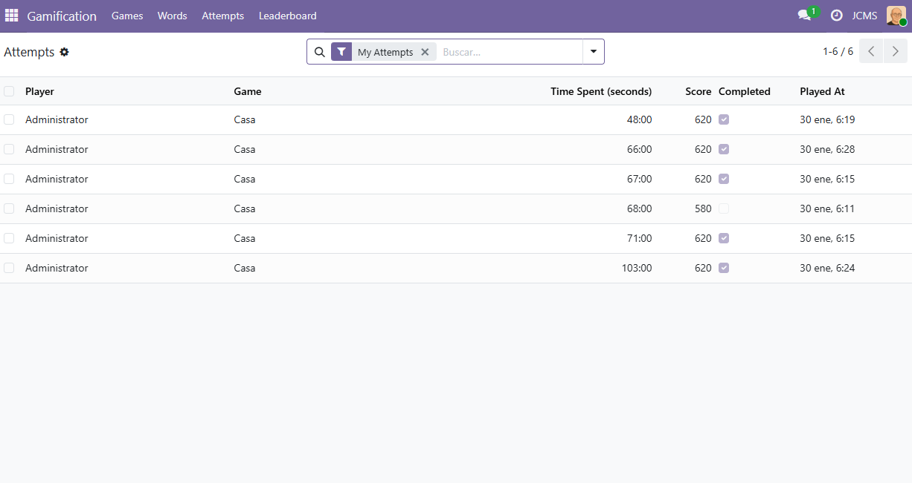
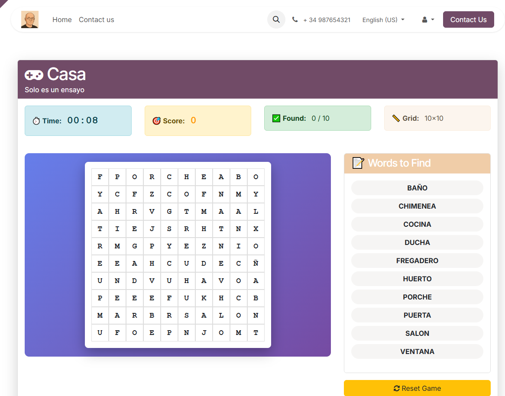
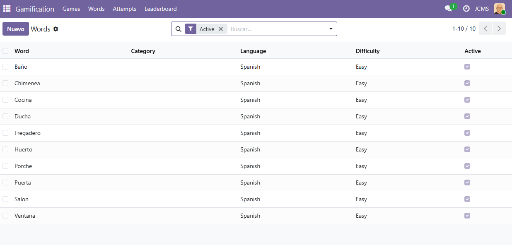
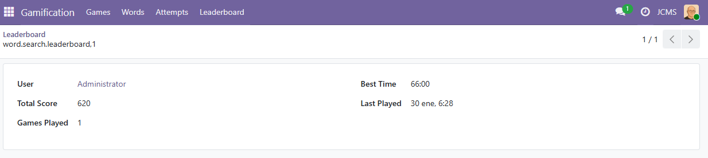
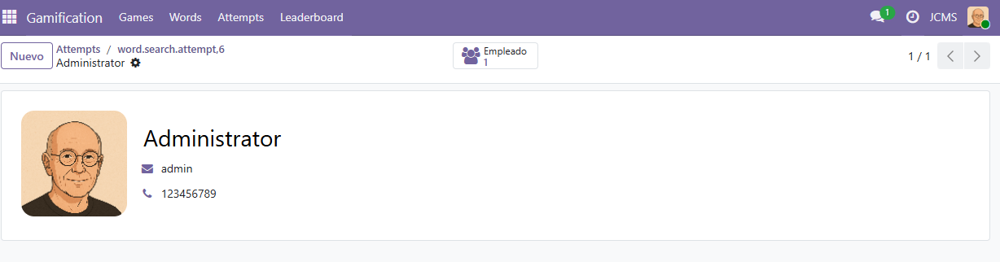

# 🎮 Odoo Word Search Gamification

Módulo de gamificación empresarial con sopas de letras interactivas para Odoo 19. Diseñado para potenciar el engagement de empleados y usuarios a través de juegos entretenidos.

## 🌟 Características principales

- **🎮 Gestión completa de juegos** - Crea y administra juegos de sopa de letras fácilmente
- **📊 Múltiples niveles de dificultad** - Easy, Medium y Hard con configuraciones flexibles
- **🎯 Cuadrícula personalizable** - Ajusta el tamaño según tus necesidades
- **👥 Integración con RR.HH.** - Conecta con el módulo de Recursos Humanos
- **🏆 Sistema de puntuación** - Registra intentos y resultados
- **📈 Tabla de clasificación** - Visualiza el desempeño de jugadores
- **⏱️ Control de tiempos** - Modo contra reloj para mayor emoción
- **🔤 Banco de palabras** - Gestión centralizada de palabras y temáticas

## 📸 Galería de pantallas

### Gestión de juegos

### Juegos finalizados

### Interfaz de juego

### Gestión de palabras

### Tabla de clasificación

### Perfil del jugador

## 🚀 Instalación

1. Copia la carpeta `word_search_gamification` en tu directorio de addons de Odoo
2. Reinicia el servidor Odoo
3. Actualiza la lista de aplicaciones
4. Busca e instala **"Word Search Gamification"**

## 📖 Uso

### Crear un juego
1. Accede a **Gamification > Juegos**
2. Haz clic en **Crear**
3. Configura:
   - Nombre del juego
   - Nivel de dificultad
   - Palabras a buscar
   - Tiempo límite (opcional)
4. Guarda y publica el juego

### Jugar
1. Los usuarios pueden acceder a los juegos desde el portal
2. Selecciona un juego para comenzar
3. Busca todas las palabras en la sopa de letras
4. Consulta tu puntuación en la tabla de clasificación

### Administrar palabras
- Accede a **Gamification > Palabras** para mantener el banco de palabras
- Organiza por temáticas y niveles
- Reutiliza palabras en múltiples juegos

## 🎯 Casos de uso

- **Entrenamiento empresarial** - Gamifica tus programas de capacitación
- **Eventos corporativos** - Compite entre departamentos
- **Recursos Humanos** - Pruebas de lenguaje y vocabulario
- **Educación** - Aprende nuevas palabras de forma divertida

## 👤 Autor

**Juan Carlos Macías**
- Website: https://www.juancarlosmacias.es
- Email: juancarlosmaciassalvador@gmail.com

## 📄 Licencia

LGPL-3
